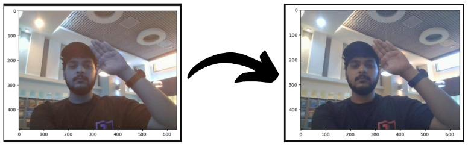
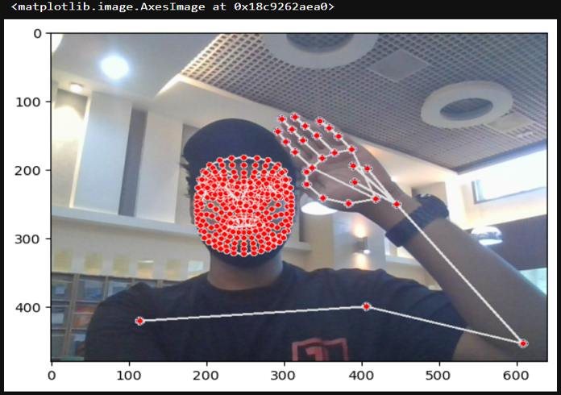
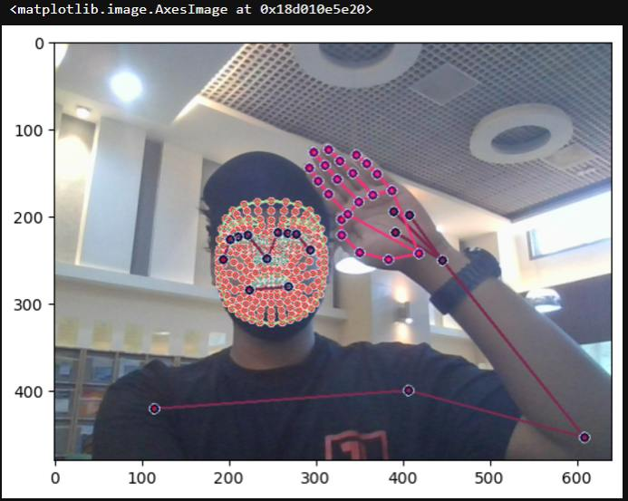
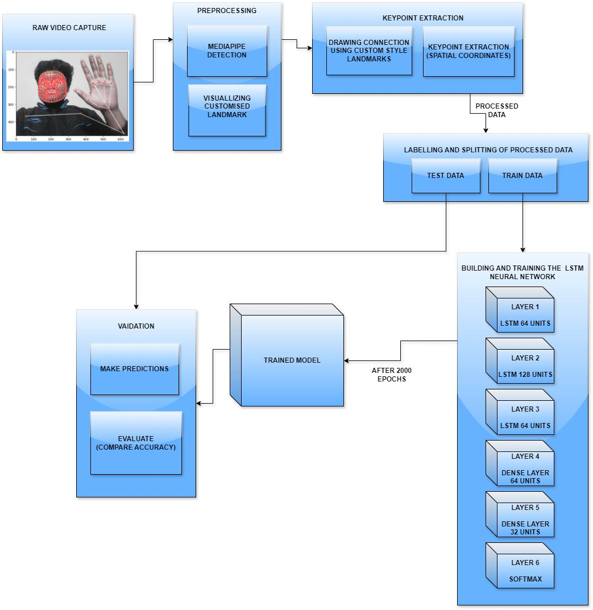
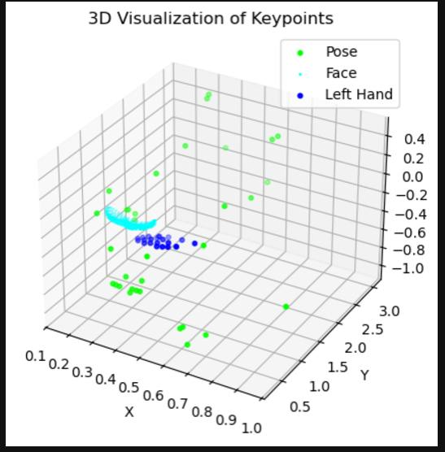
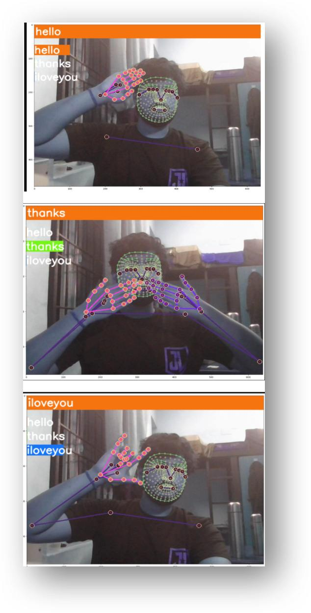
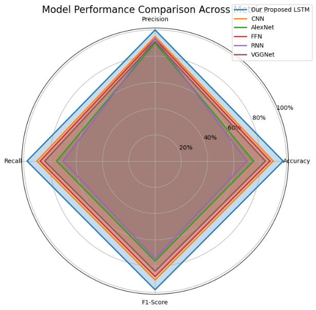
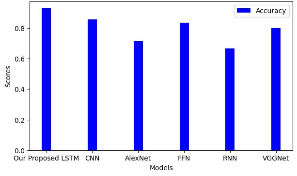

# Real-Time Sign Language Recognition using Deep Learning

This project implements a real-time sign language recognition system using deep learning. It captures sign language gestures from a webcam, processes the keypoints using Google MediaPipe, and classifies the gestures using an LSTM-based model.

The main execution file for this project is the **`Action Detection Refined.ipynb`** Colab notebook, which covers all steps including data preprocessing, model training, and real-time gesture detection.

## Project Overview

The project uses deep learning to detect and classify sign language gestures such as "hello," "thanks," and "I love you." The process involves:

1. **Data Acquisition**: Capturing video input from a webcam.
2. **Keypoint Extraction**: Using Google MediaPipe to extract keypoints (body, hand, face landmarks).
3. **Model Design**: Training a Long Short-Term Memory (LSTM) network to recognize gestures.
4. **Real-Time Detection**: Using the trained model to predict gestures in real-time from webcam footage.

## Methodology

### 1. Data Acquisition and Preprocessing
Video frames are captured from a webcam, and MediaPipe is used to detect keypoints such as body, hand, and face landmarks. These keypoints are then visualized and converted into numerical feature vectors.

### 2. Keypoint Extraction
The extracted keypoints from each frame are processed and converted into sequences for input into the model. Missing keypoints are handled by padding the data.

### 3. Model Training
An LSTM-based neural network is used to classify the sequences of keypoints. The model is trained to recognize the gestures in the dataset, and the performance is evaluated using accuracy metrics.

### 4. Real-Time Prediction
The model is deployed in real-time, where it continuously captures video frames, extracts keypoints, and predicts gestures live.

## How to Run

1. **Clone the repository:**

2. **Setup**: Open the Colab notebook, and install necessary dependencies. The code will handle data preprocessing, model training, and testing.

3. **Run the Notebook**: Execute each cell in the notebook. The notebook will guide you through the steps for training the model and performing real-time gesture detection.

## Results

The model achieved an **accuracy of 92%** for recognizing gestures. The performance was evaluated based on real-time webcam input, and the system successfully predicted gestures like "hello," "thanks," and "I love you."

### Visual Outputs

#### **Figure 1: Conversion of image from BGR to RGB for holistic model processing**
This figure demonstrates the initial step in preprocessing where an image is converted from BGR (default OpenCV color format) to RGB (used by the model).

#### **Figure 2: Keypoint detection to draw landmarks and connections**
The keypoints extracted from the image are used to detect and connect landmarks to help identify the hand gesture.

#### **Figure 3: Custom style landmark creation to represent face, hands, and body posture**
In this step, custom landmarks are created to represent the various regions, including the face, hands, and body posture.

#### **Figure 4: Proposed Methodology**
The proposed methodology outlines the entire process, from data collection to real-time gesture recognition using the trained model.

#### **Figure 5: Visualization of KeyPoints extracted from the recorded image**
This diagram illustrates the process of visualizing the keypoints that have been extracted from the recorded image using MediaPipe.

#### **Figure 6: Real time prediction results**
This diagram illustrates the real time testing of the pretrained model on various different emotions

#### **Figure 7: Model Performance Comparison Across Metrics**
This chart compares various metrics of the model, showcasing the model's performance across different evaluation criteria.

#### **Figure 8: Model Performance Comparison Across Accuracy**
This graph compares the model's accuracy during training and testing phases, demonstrating its predictive accuracy for sign language gestures.

